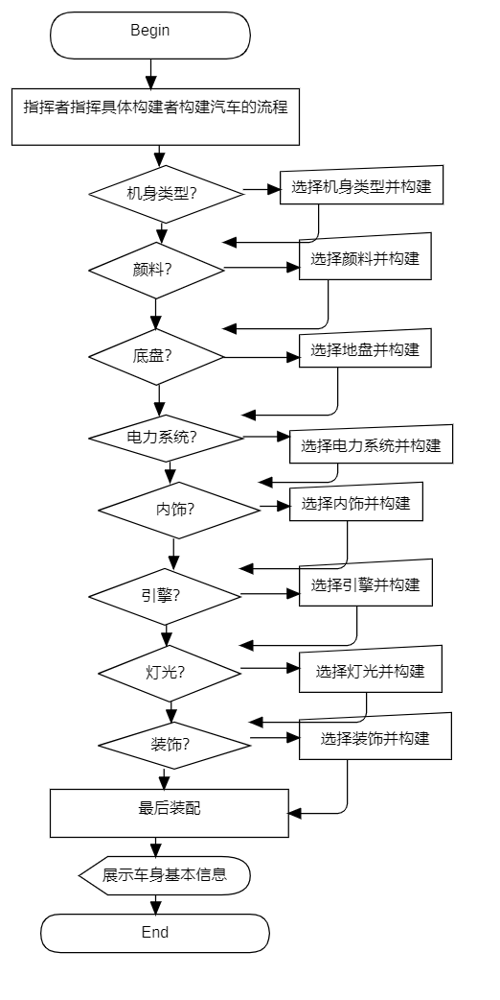

# 建造者模式

## 结构

### 类图

本目录下的类图如下：

**抽象建造者类Builder**:这个接口规定了要实现汽车生产的各个部分的创建接口。

**具体建造者类CarBuilder**:实现Builder接口，完成汽车各个部件的创建方法。

**汽车类Car**：要创建的产品，有以下8种属性。

1. **BodyType**表示汽车的车身类型，有金属焊接车身、铝制车身、碳纤维车身3种类型。
2. **PaintType**表示汽车的油漆类型，有底漆和油漆、金属漆、透明涂层3种类型。
3. **ChassisType**表示汽车的底盘类型，有组装式底盘、单壳结构底盘、空间框架底盘3种类型。
4. **EngineType**表示汽车的发动机类型，有已安装的发动机、电动发动机、混合动力发动机3种类型。
5. **ElectricalSystemType**表示汽车的电气系统类型，有有线电气系统、无线电气系统、智能电气系统3种类型。
6. **InteriorType**表示汽车的内饰类型，有已安装的内饰、皮革内饰、布料内饰3种类型。
7. **LightsType**表示汽车的灯光类型，有已安装的灯光、LED灯光、氙气灯光3种类型。
8. **DecorationsType**表示汽车的装饰类型，有已应用的装饰、定制装饰、标准装饰3种类型。

**指挥者类Director**：指挥具体建造者例如CarBuilder组装汽车，按照焊接车身、涂装、组装底盘、 安装发动机和变速器、电气系统安装、安装车身部件、 安装车灯和信号灯、 测试和质量控制、 涂装和装饰、 最终组装和检查等9个步骤进行组装。

### 流程图

​	构建者模式的流程较为简单，首先是指挥者按照一定顺序调用具体实现类构建组件的方法，本例中每一步中组件的类型都是需要用户进行选择的（用斜方框表示），选择完之后构建并进行下一步，最后装配将所有的组件组合连接在一起。然后是展示车身基本信息，可以查看用户做出选择的汽车的每一个构建的类型，流程结束。

## 代价分析

### 缺点
1. 通常来说，建造者模式会涉及到多个类的创建，增大性能开销，这里我们各部件采用的是枚举量，较为简单，因此性能开销不会很大。
2. 由于本设计中只有一个具体构建者，建造者模式的优势没有发挥出来，Builder和CarBuilder显得有一些冗余。
3. 即使未来有了更多的具体建造者类，由于抽象建造类规定了产品的组件，因此建造者模式只适用于高度相似的不同类型产品，因此适用范围较窄。
### 优点
1. 可以更加精细地控制产品的创建过程 。将复杂产品的创建步骤分解，使得创建过
程更加清晰，用指挥者控制创建过程也更灵活方便。
2. 在本模式中，客户可以不必知道构建的具体细节，只需要根据一样的流程就能创造出不同的产品，实现了解耦。