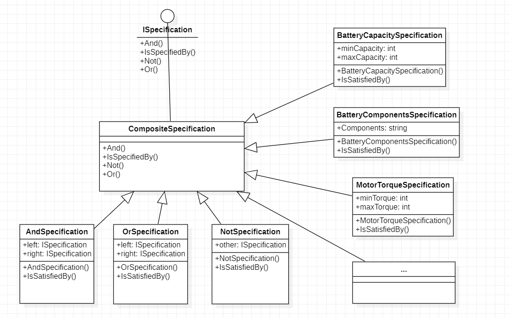

## 规约模式 Specification Pattern

规约模式通过使用布尔逻辑将业务规则链接在一起，从而实现业务规则的重新组合。该模式经常在领域驱动设计的上下文中使用。它允许我们将领域知识的某个部分封装成一个单一单元 - 规约 - 并在代码库的不同部分重用它。

### 结构

类图如下：

- **抽象类ISpecification**：
  用于定义规约（specification）的接口，包括检查是否满足规约的函数和逻辑运算函数（与、与非、或、或非、非）。

- **抽象类CompositeSpecification**：
  规约的抽象基类。实现逻辑运算函数。

- **具体的逻辑运算规约类**：
  AndSpecification, OrSpecification, NotSpecification, AndNotSpecification, OrNotSpecification. 用于进行规约的逻辑运算及其组合。

- **具体的业务规约类**：
  BatteryCapacitySpecification用于按电池容量范围检索电池零件，MotorPowerSpecification用于按电机功率范围检索电机零件，MotorPowerSpecification用于按工厂剩余该零件的数量检索零件等。

- **CarPart及其子类**：
  CarPart 是一个抽象基类，定义了零部件的接口。Battery 和 Motor 是具体的零部件类，实现了 CarPart 接口。**

通过各种业务规约类的逻辑运算组合，可以实现各种业务逻辑需求。如在这里的示例中可以通过组合各种规约，进而检索任意的零件的情况。