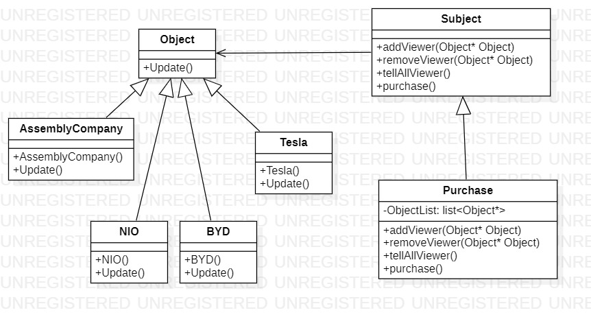

# 设计模式简介

## 设计模式名称

观察者模式（Observer Pattern）

## 涉及的文件

头文件

AssemblyCompany.h

BYD.h

NIO.h

Object.h

Purchase.h

Subject.h

Tesla.h

源文件

AssemblyCompany.cpp

BYD.cpp

main.cpp

NIO.cpp

Purchase.cpp

Tesla.cpp

## 何处体现

汽车零件采购完成后采购人员通知装配公司与零件供货商

# 设计模式详述

## 实现描述

采购人员受装配公司委派进行零件采购工作。同时零件供货商也需要观察采购方是否完成采购。当采购动作完成，采购人员必须通知供货商已采购以便于供货商更新自己的零件余量状态，同时还要通知装配公司采购已完成，以便于让装配公司获知目前采购到的零件状况以进行下一步装配工作。在这个程序中，装配公司和供货商为观察者，采购人员为被观察者。

## 类图

首先抽象出两个基类，Object作为观察者的基类，Subject作为被观察对象的基类。Purchase为具体被观察对象，AssemblyCompany、Tesla、NIO、BYD为具体观察者。每一个观察者都实现了基类中的Update方法更新自己的状态，Purchase类中存储一个观察者列表，使用多态方式。被观察者在采购动作完成后，将会调用观察者的Update函数通知观察者更新状态

## 流程图

## 代价分析

使用观察者模式具有一定的优点：

1. 降低了目标与观察者之间的耦合关系，两者之间是抽象耦合关系。
2. 目标与观察者之间建立了一套触发机制。

但是使用该模式的过程中也存在效率和逻辑安全性的问题：

1. 目标与观察者之间的依赖关系并没有完全解除，而且有可能出现循环引用。
2. 当观察者对象很多时，通知的发布会花费很多时间，影响程序的效率。